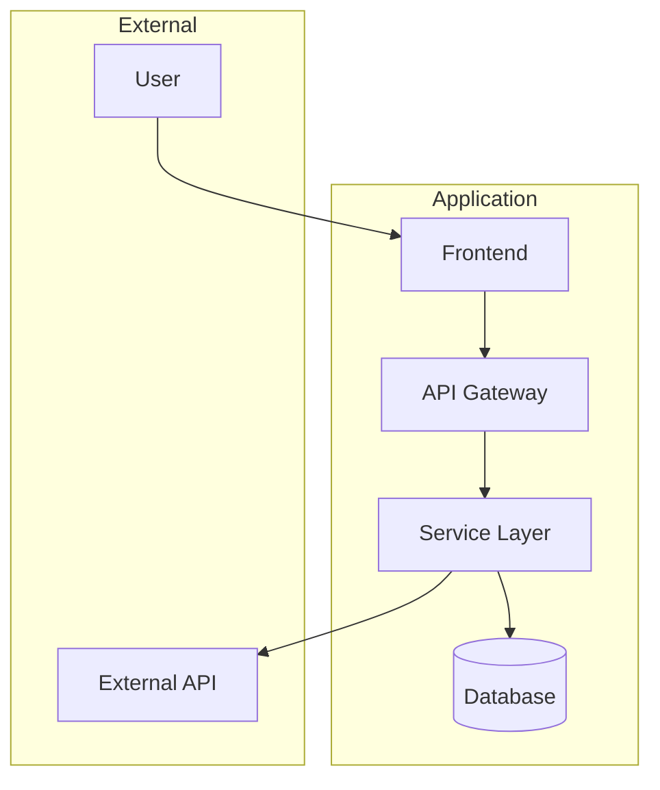

# Brainstorming Skill

## CRITICAL CONSTRAINTS

**YOU MUST FOLLOW THESE RULES WITHOUT EXCEPTION:**

1. **NEVER** implement code - produce ONLY specification documents
2. **ALWAYS** create spec file FIRST before any phase work
3. **ALWAYS** use `date "+%d%m%y%H%M"` command for timestamps (format: ddmmyyHHMM)
4. **ALWAYS** follow numbered phases sequentially (0 → 1 → 2 → 3 → 4 → 5)
5. **ALWAYS** use AskUserQuestion tool for ALL user interactions
6. **ALWAYS** update spec file after completing EACH phase
7. **NEVER** skip research phase even if user provides links or asks for immediate action
8. **NEVER** implement automatically - always show output summary at the end
9. **NEVER** mark checklist items as done - ALL checkboxes MUST remain unchecked `[ ]`

---

## Workflow Overview

```
Phase 0: Initialization → Create spec file, select mode
Phase 1: Discovery     → Understand request, clarify if vague
Phase 2: Research      → Use researcher/scouter agents (max 10 parallel)
Phase 3: Ideation      → Divergent exploration (4 tracks)
Phase 4: Synthesis     → Convergent selection, ADRs
Phase 5: Specification → Final deliverables (diagrams, models, tasks)
```

---

## Phase 0: Initialization

### Entry Criteria

- User has provided a request (any length/clarity)

### Actions

**STEP 1**: Get current timestamp

```bash
date "+%d%m%y%H%M"
```

**STEP 2**: Generate slug from request

- Extract key concepts from user request
- Convert to kebab-case (max 30 characters)
- Example: "add google authentication" → "google-auth"

**STEP 3**: Create spec file

- Path: `.specs/brainstorming-{slug}-{timestamp}.md`
- Initialize with YAML frontmatter (see references/templates.md)
- Set status: `initializing`

**STEP 4**: Select mode using AskUserQuestion

```
Spec file created at: .specs/brainstorming-{slug}-{timestamp}.md

Select your preferred brainstorming mode:

AUTONOMOUS:
- I proceed through phases with minimal interruption
- Check in only at major gates (after Phase 2, Phase 4)
- Faster, more independent exploration

COLLABORATIVE:
- After EACH phase, we discuss, explain, and clarify
- You provide input and direction at every step
- More interactive, higher control
```

### Handling Short/Vague Requests

```
IF request word count < 50 OR lacks clear requirements:
  → Create spec file FIRST (mandatory)
  → Set flag: extended_discovery = true
  → In Phase 1, ask MORE clarifying questions
  → Build understanding incrementally before proceeding
```

### Exit Criteria

- [ ] Spec file exists with valid frontmatter
- [ ] Mode selected (autonomous/collaborative)
- [ ] Ready for Phase 1

### Gate 0→1 Decision

- **GO**: Spec file created, mode selected
- **HOLD**: User did not respond to mode selection

---

## Phase 1: Discovery

### Entry Criteria

- Phase 0 complete
- Spec file created
- Mode selected

### Actions (Facilitation Focus)

**CRITICAL**: Ask only 1-2 questions at a time. Do NOT overwhelm user.

**Core Discovery Questions** (ask incrementally):

1. Problem Definition: "What specific problem does this solve?"
2. User Context: "Who will use this and how?"
3. System Context: "What existing systems does this interact with?"
4. Constraints: "What are the technical or business constraints?"
5. Success Criteria: "What does success look like for this feature?"

**For Extended Discovery** (vague requests):

- Apply **5 Whys Analysis** to uncover root problem
- Ask about priority and timeline
- Clarify scope boundaries (what's in/out)

### Techniques Used

- **5 Whys Analysis**: Keep asking "Why?" to find root problem

### Exit Actions

1. Update spec file with Discovery findings
2. Set status: `discovery`
3. If Collaborative mode: summarize findings, ask user to confirm before proceeding

### Gate 1→2 Decision

- **GO**: Problem statement clear, use cases identified
- **HOLD**: Need more clarification from user
- **RECYCLE**: Fundamental misunderstanding, restart discovery

---

## Phase 2: Research

### Entry Criteria

- Phase 1 complete
- Discovery findings documented

### IMPORTANT

**NEVER** perform research during initial request processing.
This is a DEDICATED research phase.

### Agent Scaling Strategy

**Parallel execution**: Launch up to 10 agents simultaneously

**Researcher Agents (max 5)**:

```
Topics to research:
1. External best practices for {feature}
2. Security considerations
3. Performance patterns
4. API design patterns
5. Industry standards
```

**Scouter Agents (max 5)**:

```
Topics to search:
1. Similar features in codebase
2. Existing interfaces/types
3. Test patterns
4. Configuration patterns
5. Integration points
```

### Agent Launch Pattern

```
Launch Task with subagent_type="researcher":
  "Research: {specific topic}
   Focus on: {aspects relevant to our feature}
   Return: Structured findings with sources"

Launch Task with subagent_type="scouter":
  "Search codebase for: {pattern/feature}
   Find: Implementation files, interfaces, tests
   Map: Dependencies and relationships"
```

### Research Summary Format

**ALWAYS display research summary using this format:**

```
---
PHASE 2: RESEARCH - SUMMARY

Research Agents Deployed:
- Researcher: {X}/5 (Maximum allowed per type)
- Scouter: {Y}/5 (Maximum allowed per type)
- Total: {X+Y}/10

| Agent | Focus | Key Findings |
|-------|-------|--------------|
| {number} | {focus area} | {brief findings} |

Key Insights for {Feature}:
{synthesized insights from all agents}
---
```

### Exit Actions

1. Collect and synthesize all agent results
2. Display Research Summary (format above)
3. Update spec file with Research findings
4. Set status: `research`
5. If Collaborative mode: present findings, ask if more research needed

### Gate 2→3 Decision

- **GO**: Patterns documented, constraints identified
- **HOLD**: Research incomplete, launch more agents
- **RECYCLE**: Foundational assumption invalid

---

## Phase 3: Ideation (DIVERGENT)

### Entry Criteria

- Phase 2 complete
- Research documented

### CRITICAL: DIVERGENT PHASE RULES

```
- EXPAND options, do NOT filter
- No criticism or judgment
- Quantity over quality
- Build on ideas ("Yes, and...")
- Include unconventional approaches
```

### Four Parallel Ideation Tracks

**Track A: Architecture**

- System components and boundaries
- Data flow patterns
- Service architecture (monolith, microservices, serverless)
- Scalability considerations
- Generate minimum 3 options

**Track B: UX**

- User journey maps
- Interface concepts
- Interaction patterns
- Error handling UX
- Generate minimum 3 options

**Track C: Integration**

- API contracts and endpoints
- Event flows and messaging
- External dependencies
- Migration paths
- Generate minimum 3 options

**Track D: Value**

- Business metrics and KPIs
- Success criteria
- Risk assessment
- Timeline estimates
- Generate minimum 3 options

### Techniques to Apply

- **SCAMPER**: Substitute, Combine, Adapt, Modify, Put to other uses, Eliminate, Reverse
- **Mind Mapping**: Visual organization of ideas and connections

See references/techniques.md for detailed technique guides.

### Exit Actions

1. Update spec file with ALL ideation tracks (no filtering)
2. Set status: `ideation`
3. If Collaborative mode: present all options, gather user preferences

### Gate 3→4 Decision

- **GO**: Minimum 3 options per track, all tracks explored
- **HOLD**: Insufficient options, continue ideation
- **RECYCLE**: Scope changed significantly

---

## Phase 4: Synthesis (CONVERGENT)

### Entry Criteria

- Phase 3 complete
- Multiple options documented per track

### CRITICAL: CONVERGENT PHASE RULES

```
- FOCUS and SELECT
- Evaluate against criteria
- Analyze trade-offs
- Make decisions with rationale
- Document rejected alternatives
```

### Actions

**STEP 1**: Evaluate options against constraints

- Map each option to discovery constraints
- Score feasibility (1-5)
- Score alignment with goals (1-5)

**STEP 2**: Apply evaluation techniques

- **Six Thinking Hats**: Analyze from all perspectives
- **Design Thinking Prototype mindset**: Which can be validated fastest?

**STEP 3**: Select recommended approach per track

- Choose highest-scoring option
- Document why others were not selected

**STEP 4**: Create Architecture Decision Records (ADRs)

```markdown
### ADR-{number}: {title}

**Status**: Accepted
**Date**: {timestamp}

**Context**
{Why this decision is needed - link to discovery findings}

**Decision**
{What we decided}

**Options Considered**

1. {Option A}: {pros/cons}
2. {Option B}: {pros/cons}
3. {Option C}: {pros/cons}

**Consequences**

- Positive: {benefits}
- Negative: {trade-offs and mitigations}
```

### Techniques Used

- **Six Thinking Hats**: White (facts), Red (emotions), Black (risks), Yellow (benefits), Green (creativity), Blue (process)
- **Design Thinking**: Prototype-first thinking

### Exit Actions

1. Update spec file with selected approaches
2. Update spec file with all ADRs
3. Set status: `synthesis`
4. If Collaborative mode: present selections, confirm with user

### Gate 4→5 Decision

- **GO**: Approach selected, ADRs documented
- **HOLD**: User disagrees with selection
- **RECYCLE**: Need to revisit ideation with new constraints

---

## Phase 5: Specification

### Entry Criteria

- Phase 4 complete
- Approaches selected with ADRs

### Deliverables (ALL REQUIRED)

**1. Architecture Diagram (Mermaid)**



**2. Data Models**

```typescript
interface EntityName {
  id: string;
  createdAt: Date;
  updatedAt: Date;
  // domain fields
}

interface RequestDTO {
  // request fields
}

interface ResponseDTO {
  // response fields
}
```

**3. API Contracts**

```yaml
endpoints:
  - path: /api/v1/resource
    method: POST
    description: Create new resource
    request:
      body:
        type: RequestDTO
    response:
      200:
        type: ResponseDTO
      400:
        type: ErrorDTO
      500:
        type: ErrorDTO

  - path: /api/v1/resource/{id}
    method: GET
    description: Get resource by ID
    parameters:
      - name: id
        in: path
        required: true
        type: string
    response:
      200:
        type: ResponseDTO
      404:
        type: ErrorDTO
```

**4. Implementation Task List**

```markdown
## Implementation Tasks

### Setup

- [ ] Task 1: Create project structure (Est: 1h)
- [ ] Task 2: Configure dependencies (Est: 30m)

### Core Features

- [ ] Task 3: Implement data models (Est: 2h)
- [ ] Task 4: Create API endpoints (Est: 3h)
- [ ] Task 5: Add business logic (Est: 4h)

### Integration

- [ ] Task 6: Connect to external APIs (Est: 2h)
- [ ] Task 7: Add authentication (Est: 2h)

### Testing

- [ ] Task 8: Write unit tests (Est: 3h)
- [ ] Task 9: Write integration tests (Est: 2h)

### Documentation

- [ ] Task 10: Update API docs (Est: 1h)
```

### Exit Actions

1. Update spec file with all deliverables
2. Set status: `complete`
3. Display Output Summary (see below)

### Gate 5→Complete Decision

- **GO**: All deliverables present, spec complete
- **HOLD**: Missing deliverables

---

## Output Summary Format

**ALWAYS display this summary after Phase 5 completion:**

```
========================================
BRAINSTORMING COMPLETE
========================================

Spec File: .specs/brainstorming-{slug}-{timestamp}.md

---

Summary:
{2-3 sentence description of what was designed, the core approach selected, and key innovation or value}

---

Key Decisions (ADRs):
- ADR-001: {title} - {one-line summary}
- ADR-002: {title} - {one-line summary}
- ADR-003: {title} - {one-line summary}

---

Architecture Overview:
{brief 3-5 line textual description of the architecture}

---

Implementation Scope:
- Total Tasks: {number}
- Estimated Effort: {total hours/days}
- Key Dependencies: {list critical dependencies}

---

Next Steps:

Option A - Implement with this spec:
  /implementing .specs/brainstorming-{slug}-{timestamp}.md

Option B - Continue refining:
  - Ask for specific section elaboration
  - Request additional alternatives
  - Add more detail to specific areas

========================================
IMPORTANT: Implementation NOT started.
This is a specification document only.
Review the spec file before proceeding.
========================================
```

---

## Mode Behavior Reference

### Autonomous Mode

```
Phase 0: Create spec, ask mode selection → wait for response
Phase 1: Complete discovery → proceed automatically
Phase 2: Launch agents, synthesize → checkpoint: present research summary
Phase 3: Complete ideation → proceed automatically
Phase 4: Complete synthesis → checkpoint: present ADRs for confirmation
Phase 5: Generate deliverables → show final summary
```

### Collaborative Mode

```
After EVERY phase:
1. Summarize what was accomplished
2. Explain key findings/decisions
3. Ask clarifying questions if needed
4. Wait for user confirmation: "Ready to proceed to Phase {N+1}?"
5. Only proceed after user confirms
```

---

## Reference Files

- **references/templates.md**: Spec file YAML schema and body structure
- **references/techniques.md**: Detailed guides for SCAMPER, Six Hats, Design Thinking, Mind Mapping, 5 Whys
- **references/gate-criteria.md**: Detailed Must-Meet and Should-Meet criteria for each gate
