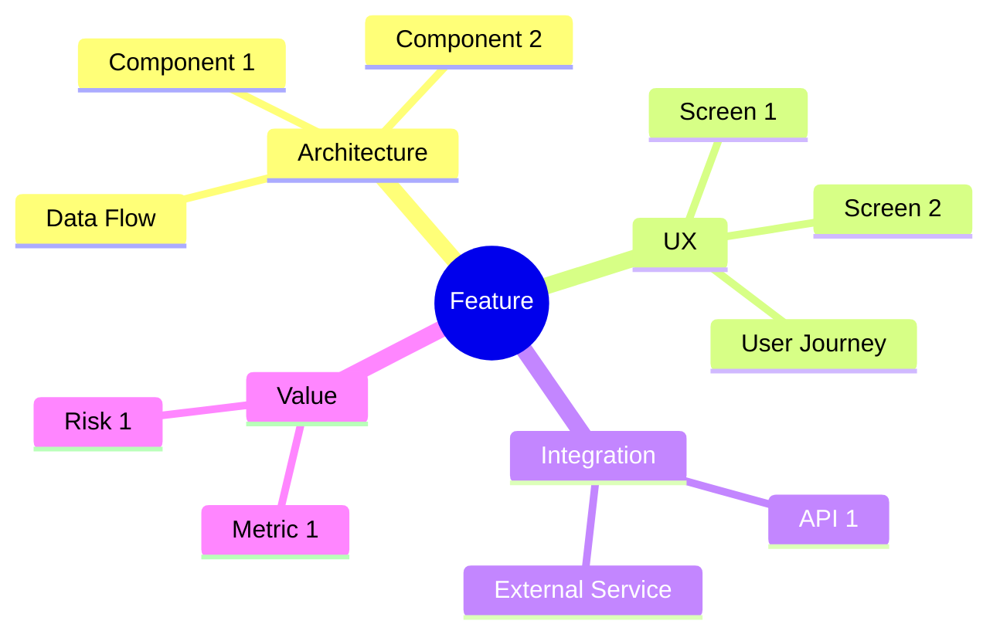

# Brainstorming Techniques Reference

## Technique Application by Phase

| Phase              | Recommended Techniques             | Purpose                |
| ------------------ | ---------------------------------- | ---------------------- |
| Phase 1: Discovery | 5 Whys Analysis                    | Root cause exploration |
| Phase 3: Ideation  | SCAMPER, Mind Mapping              | Divergent exploration  |
| Phase 4: Synthesis | Six Thinking Hats, Design Thinking | Convergent evaluation  |

---

## 1. SCAMPER Technique

**Purpose**: Systematic innovation through structured questioning
**Best for**: Improving existing concepts, generating variations
**Phase**: 3 (Ideation - Divergent)

### The SCAMPER Framework

Apply each element to the concept/feature being designed:

| Element               | Question                 | Example Prompts                                                  |
| --------------------- | ------------------------ | ---------------------------------------------------------------- |
| **S**ubstitute        | What can be replaced?    | Different technology? Different approach? Alternative component? |
| **C**ombine           | What can be merged?      | Combine features? Merge services? Bundle responsibilities?       |
| **A**dapt             | What can be borrowed?    | Patterns from other domains? Solutions from other systems?       |
| **M**odify            | What can be changed?     | Scale differently? Alter attributes? Change behavior?            |
| **P**ut to other uses | What else could this do? | Secondary benefits? Additional use cases?                        |
| **E**liminate         | What can be removed?     | Simplify by cutting scope? Remove unnecessary features?          |
| **R**everse           | What if we flip it?      | Opposite approach? Inverted flow? Reverse the process?           |

### Application Template

```markdown
### SCAMPER Analysis: {Feature Name}

**Substitute**

- Current: {what exists now}
- Alternative 1: {substitute option}
- Alternative 2: {substitute option}

**Combine**

- Combination 1: {merge idea}
- Combination 2: {merge idea}

**Adapt**

- From {domain/system}: {adapted pattern}
- From {domain/system}: {adapted pattern}

**Modify**

- Modification 1: {what to change and how}
- Modification 2: {what to change and how}

**Put to other uses**

- Additional use 1: {new application}
- Additional use 2: {new application}

**Eliminate**

- Remove: {what can go}
- Simplify: {how to reduce complexity}

**Reverse**

- Inversion: {opposite approach}
- Reversal: {flipped process}
```

---

## 2. Six Thinking Hats

**Purpose**: Multi-perspective comprehensive analysis
**Best for**: Evaluating options, reducing groupthink, thorough assessment
**Phase**: 4 (Synthesis - Convergent)

### The Six Hats

| Hat Color  | Focus                     | Key Questions                                                               |
| ---------- | ------------------------- | --------------------------------------------------------------------------- |
| **White**  | Facts & Data              | What do we know? What data do we have? What's missing?                      |
| **Red**    | Emotions & Intuition      | How do users feel? What's my gut reaction? What concerns me?                |
| **Black**  | Risks & Caution           | What could go wrong? What are the weaknesses? What obstacles exist?         |
| **Yellow** | Benefits & Optimism       | What are the advantages? What's the best-case scenario? Why will this work? |
| **Green**  | Creativity & Alternatives | What are other options? What if we tried...? Any unconventional ideas?      |
| **Blue**   | Process & Control         | Are we on track? What's the next step? Have we covered everything?          |

### Application Template

```markdown
### Six Thinking Hats Analysis: {Option/Decision}

#### White Hat (Facts)

- Data point 1: {objective fact}
- Data point 2: {objective fact}
- Missing information: {what we don't know}

#### Red Hat (Emotions)

- User feeling: {emotional response expected}
- Team intuition: {gut feeling about this}
- Concerns: {emotional reservations}

#### Black Hat (Risks)

- Risk 1: {potential problem}
- Risk 2: {potential problem}
- Obstacle: {what could block success}

#### Yellow Hat (Benefits)

- Benefit 1: {advantage}
- Benefit 2: {advantage}
- Best-case: {optimal outcome}

#### Green Hat (Creativity)

- Alternative 1: {other approach}
- Enhancement: {improvement idea}
- Wild idea: {unconventional option}

#### Blue Hat (Process)

- Current status: {where we are}
- Next step: {what to do next}
- Gaps: {what we haven't addressed}
```

### Usage Pattern in Phase 4

1. Put on **White Hat** first - gather all facts
2. Switch to **Green Hat** - generate alternatives
3. Apply **Yellow Hat** - identify benefits of each
4. Put on **Black Hat** - identify risks of each
5. Consider **Red Hat** - note emotional/intuitive responses
6. Use **Blue Hat** - make final decision based on analysis

---

## 3. Design Thinking (5-Phase Model)

**Purpose**: User-centered design approach
**Best for**: UX-focused features, understanding user needs
**Phase**: 4 (Synthesis - for prototyping mindset)

### The Five Phases

```
EMPATHIZE → DEFINE → IDEATE → PROTOTYPE → TEST
```

| Phase         | Goal                | Key Activities                          |
| ------------- | ------------------- | --------------------------------------- |
| **Empathize** | Understand users    | User research, interviews, observation  |
| **Define**    | Frame the problem   | Problem statement, user personas, needs |
| **Ideate**    | Generate solutions  | Brainstorming, divergent thinking       |
| **Prototype** | Make ideas tangible | Quick mockups, MVPs, sketches           |
| **Test**      | Validate solutions  | User testing, feedback, iteration       |

### Mapping to Brainstorming Phases

| Design Thinking | Brainstorming Phase | Activities                |
| --------------- | ------------------- | ------------------------- |
| Empathize       | Phase 1 (Discovery) | User research, personas   |
| Define          | Phase 1 (Discovery) | Problem statement         |
| Ideate          | Phase 3 (Ideation)  | Option generation         |
| Prototype       | Phase 4 (Synthesis) | Prototype-first selection |
| Test            | Post-brainstorming  | Implementation validation |

### Application Template

```markdown
### Design Thinking Analysis: {Feature}

#### Empathize

- User 1: {persona description}

  - Pain points: {frustrations}
  - Goals: {what they want to achieve}

- User 2: {persona description}
  - Pain points: {frustrations}
  - Goals: {what they want to achieve}

#### Define

**Problem Statement**:
{User persona} needs {need} because {insight}.

**How Might We**:

- HMW {question 1}?
- HMW {question 2}?

#### Ideate

Ideas generated: {reference Phase 3 ideation}

#### Prototype Thinking

- Most prototypable option: {which can be built fastest}
- Validation approach: {how to test quickly}
- MVP scope: {minimum viable version}

#### Test Planning

- Test method: {how to validate}
- Success criteria: {what indicates success}
- Iteration trigger: {when to pivot}
```

---

## 4. Mind Mapping

**Purpose**: Visual organization of ideas and connections
**Best for**: Complex relationships, exploring connections, brainstorming expansion
**Phase**: 3 (Ideation - Divergent)

### Mind Map Structure

```
                    ┌─── Sub-topic 1.1
            ┌─── Topic 1
            │       └─── Sub-topic 1.2
            │
Central ────┼─── Topic 2 ─── Sub-topic 2.1
Concept     │
            │       ┌─── Sub-topic 3.1
            └─── Topic 3
                    └─── Sub-topic 3.2
```

### Mind Map Categories for Features

```
                        ┌─── Component 1
                ┌─── Architecture
                │       └─── Component 2
                │
                │       ┌─── Screen 1
Feature ────────┼─── UX
                │       └─── Screen 2
                │
                │       ┌─── API 1
                └─── Integration
                        └─── External Service
```

### Application Template

```markdown
### Mind Map: {Feature Name}

#### Central Node: {Feature Name}

#### Branch 1: Architecture

├── Sub-branch: Components
│ ├── {component 1}
│ └── {component 2}
├── Sub-branch: Data Flow
│ ├── {flow 1}
│ └── {flow 2}
└── Sub-branch: Infrastructure
├── {infra 1}
└── {infra 2}

#### Branch 2: User Experience

├── Sub-branch: User Journeys
│ ├── {journey 1}
│ └── {journey 2}
├── Sub-branch: Screens/Views
│ ├── {screen 1}
│ └── {screen 2}
└── Sub-branch: Interactions
├── {interaction 1}
└── {interaction 2}

#### Branch 3: Integration

├── Sub-branch: Internal APIs
│ ├── {api 1}
│ └── {api 2}
├── Sub-branch: External Services
│ ├── {service 1}
│ └── {service 2}
└── Sub-branch: Events
├── {event 1}
└── {event 2}

#### Branch 4: Value

├── Sub-branch: Business Metrics
│ ├── {metric 1}
│ └── {metric 2}
├── Sub-branch: User Benefits
│ ├── {benefit 1}
│ └── {benefit 2}
└── Sub-branch: Risks
├── {risk 1}
└── {risk 2}
```

### Mermaid Mind Map (Optional Visualization)



---

## 5. 5 Whys Analysis

**Purpose**: Root cause exploration through iterative questioning
**Best for**: Problem definition, understanding underlying issues
**Phase**: 1 (Discovery)

### The Process

1. State the problem
2. Ask "Why?" and answer
3. Take that answer and ask "Why?" again
4. Repeat until you reach the root cause (typically 5 iterations)

### Example

```
Problem: Users are abandoning the checkout process

Why 1: Users are confused by the payment form
Why 2: The form has too many required fields
Why 3: We're collecting data we don't actually need
Why 4: Requirements were never validated with users
Why 5: No user research was conducted before building
ROOT CAUSE: Lack of user research in the design process
```

### Application Template

```markdown
### 5 Whys Analysis: {Problem Statement}

**Initial Problem**: {describe the observed problem}

**Why 1**: Why is this happening?

- Answer: {first level cause}

**Why 2**: Why {first level cause}?

- Answer: {second level cause}

**Why 3**: Why {second level cause}?

- Answer: {third level cause}

**Why 4**: Why {third level cause}?

- Answer: {fourth level cause}

**Why 5**: Why {fourth level cause}?

- Answer: {root cause}

---

**Root Cause Identified**: {final root cause}

**Implications for Solution**:

- Must address: {what the solution needs to solve}
- Should avoid: {what not to repeat}
- Consider: {additional factors}
```

### Tips for Effective 5 Whys

1. **Stay focused** - Don't branch into multiple causes too early
2. **Be specific** - Vague answers lead to vague root causes
3. **Stop when actionable** - The root cause should suggest a solution
4. **May need fewer or more** - 5 is a guideline, not a rule
5. **Verify with data** - Validate assumptions where possible

---

## Technique Selection Guide

| Situation                     | Recommended Technique            |
| ----------------------------- | -------------------------------- |
| Request is vague/unclear      | 5 Whys Analysis                  |
| Need to generate many options | SCAMPER + Mind Mapping           |
| Need to evaluate trade-offs   | Six Thinking Hats                |
| Focus is on user experience   | Design Thinking                  |
| Need to see relationships     | Mind Mapping                     |
| Need to improve existing idea | SCAMPER                          |
| Need comprehensive evaluation | Six Thinking Hats                |
| Need to validate assumptions  | Design Thinking (Prototype/Test) |

---

## Quick Reference Cards

### SCAMPER Quick Card

```
S - Substitute: What else? Who else? What material?
C - Combine: What ideas can combine? What purposes?
A - Adapt: What else is like this? What ideas does it suggest?
M - Modify: Change meaning, color, motion, sound, form, shape?
P - Put to other uses: New ways to use as is? Other uses if modified?
E - Eliminate: What to remove? Simplify? Reduce?
R - Reverse: Opposites? Turn it around? Inside out?
```

### Six Hats Quick Card

```
WHITE - Data and information
RED - Emotions and feelings
BLACK - Caution and risks
YELLOW - Benefits and optimism
GREEN - Creativity and alternatives
BLUE - Process and control
```

### Design Thinking Quick Card

```
EMPATHIZE - Understand the user
DEFINE - Frame the right problem
IDEATE - Generate solutions
PROTOTYPE - Make ideas tangible
TEST - Validate and iterate
```

### 5 Whys Quick Card

```
Problem → Why? → Why? → Why? → Why? → Why? → ROOT CAUSE
Keep asking until you can take action
```
