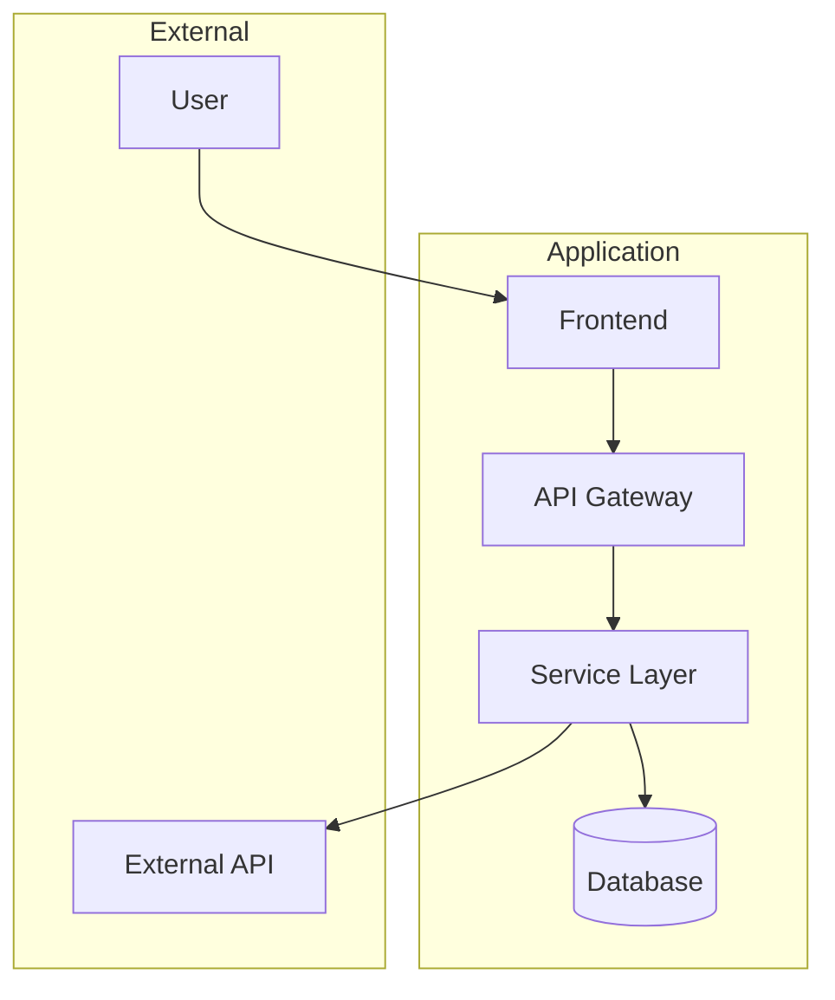

# Spec File Templates

## File Naming Convention

```
brainstorming-{slug}-{ddmmyyHHMM}.md
```

**Components:**

- `brainstorming`: Fixed prefix
- `{slug}`: Kebab-case summary of request (max 30 chars)
- `{ddmmyyHHMM}`: Timestamp from `date "+%d%m%y%H%M"`

**Examples:**

- `brainstorming-google-auth-1701262045.md`
- `brainstorming-user-dashboard-1701262130.md`
- `brainstorming-payment-integration-1701262215.md`

---

## YAML Frontmatter Schema

```yaml
---
spec_type: brainstorming
version: 1.0
slug: { request-slug }
created_at: { ddmmyyHHMM }
updated_at: { ddmmyyHHMM }
priority: HIGH | MEDIUM | LOW
status: initializing | discovery | research | ideation | synthesis | complete
mode: autonomous | collaborative
current_phase: 0 | 1 | 2 | 3 | 4 | 5
extended_discovery: true | false
related_files: []
tags: []
---
```

**Field Descriptions:**

| Field              | Required | Description                    |
| ------------------ | -------- | ------------------------------ |
| spec_type          | Yes      | Always "brainstorming"         |
| version            | Yes      | Schema version (currently 1.0) |
| slug               | Yes      | Kebab-case identifier          |
| created_at         | Yes      | Timestamp when created         |
| updated_at         | Yes      | Timestamp of last update       |
| priority           | Yes      | HIGH, MEDIUM, or LOW           |
| status             | Yes      | Current phase status           |
| mode               | Yes      | autonomous or collaborative    |
| current_phase      | Yes      | Current phase number (0-5)     |
| extended_discovery | No       | True if request was vague      |
| related_files      | No       | Array of related file paths    |
| tags               | No       | Array of categorization tags   |

---

## Complete Spec File Template

````markdown
---
spec_type: brainstorming
version: 1.0
slug: { slug }
created_at: { ddmmyyHHMM }
updated_at: { ddmmyyHHMM }
priority: MEDIUM
status: initializing
mode: collaborative
current_phase: 0
extended_discovery: false
related_files: []
tags: []
---

# Brainstorming: {Title}

## Meta

| Field    | Value                            |
| -------- | -------------------------------- |
| Request  | {original user request verbatim} |
| Created  | {ddmmyyHHMM}                     |
| Mode     | {autonomous/collaborative}       |
| Status   | {current status}                 |
| Priority | {HIGH/MEDIUM/LOW}                |

---

## Phase 1: Discovery

### Problem Statement

{Clear articulation of the problem being solved}

### User Personas

| Persona | Description    | Primary Needs    |
| ------- | -------------- | ---------------- |
| {Name}  | {Who they are} | {What they need} |

### Use Cases

1. **UC-001**: {Use case title}
   - Actor: {who}
   - Trigger: {what starts this}
   - Flow: {brief description}
   - Outcome: {expected result}

### Constraints

| Type      | Constraint   | Impact   |
| --------- | ------------ | -------- |
| Technical | {constraint} | {impact} |
| Business  | {constraint} | {impact} |
| Timeline  | {constraint} | {impact} |

### Success Criteria

- [ ] {Measurable criterion 1}
- [ ] {Measurable criterion 2}
- [ ] {Measurable criterion 3}

### 5 Whys Analysis (if extended discovery)

1. Why? {answer 1}
2. Why? {answer 2}
3. Why? {answer 3}
4. Why? {answer 4}
5. Why? {root cause}

---

## Phase 2: Research

### Codebase Analysis (Scouter Findings)

#### Similar Features Found

| Feature   | Location    | Relevance        |
| --------- | ----------- | ---------------- |
| {feature} | {file path} | {how it relates} |

#### Existing Patterns

- **Pattern 1**: {description} (found in {location})
- **Pattern 2**: {description} (found in {location})

#### Interfaces & Types

```typescript
// Relevant existing interfaces
{
  code;
}
```
````

### External Research (Researcher Findings)

#### Best Practices

| Practice   | Source       | Applicability  |
| ---------- | ------------ | -------------- |
| {practice} | {source URL} | {how to apply} |

#### Security Considerations

- {consideration 1}
- {consideration 2}

#### Performance Patterns

- {pattern 1}
- {pattern 2}

### Technical Constraints Identified

| Constraint   | Source             | Mitigation      |
| ------------ | ------------------ | --------------- |
| {constraint} | {where discovered} | {how to handle} |

---

## Phase 3: Ideation

### Track A: Architecture Options

#### Option A1: {Name}

- **Description**: {what this approach is}
- **Pros**: {advantages}
- **Cons**: {disadvantages}
- **Fit Score**: {1-5}

#### Option A2: {Name}

- **Description**: {what this approach is}
- **Pros**: {advantages}
- **Cons**: {disadvantages}
- **Fit Score**: {1-5}

#### Option A3: {Name}

- **Description**: {what this approach is}
- **Pros**: {advantages}
- **Cons**: {disadvantages}
- **Fit Score**: {1-5}

### Track B: UX Options

#### Option B1: {Name}

- **Description**: {what this approach is}
- **User Flow**: {brief flow description}
- **Pros**: {advantages}
- **Cons**: {disadvantages}

#### Option B2: {Name}

...

#### Option B3: {Name}

...

### Track C: Integration Options

#### Option C1: {Name}

- **Description**: {what this approach is}
- **API Design**: {brief API approach}
- **Dependencies**: {external dependencies}
- **Pros**: {advantages}
- **Cons**: {disadvantages}

#### Option C2: {Name}

...

#### Option C3: {Name}

...

### Track D: Value Options

#### Option D1: {Name}

- **Business Value**: {value proposition}
- **Metrics**: {how to measure success}
- **Timeline**: {estimated timeline}
- **Risk Level**: {low/medium/high}

#### Option D2: {Name}

...

#### Option D3: {Name}

...

### SCAMPER Analysis Applied

| Element          | Question                 | Ideas Generated |
| ---------------- | ------------------------ | --------------- |
| Substitute       | What can be replaced?    | {ideas}         |
| Combine          | What can be merged?      | {ideas}         |
| Adapt            | What can be borrowed?    | {ideas}         |
| Modify           | What can be changed?     | {ideas}         |
| Put to other use | What else could this do? | {ideas}         |
| Eliminate        | What can be removed?     | {ideas}         |
| Reverse          | What if we flip it?      | {ideas}         |

---

## Phase 4: Synthesis

### Selected Approaches

| Track        | Selected Option | Rationale    |
| ------------ | --------------- | ------------ |
| Architecture | {Option AX}     | {why chosen} |
| UX           | {Option BX}     | {why chosen} |
| Integration  | {Option CX}     | {why chosen} |
| Value        | {Option DX}     | {why chosen} |

### Architecture Decision Records

#### ADR-001: {Title}

**Status**: Accepted
**Date**: {ddmmyyHHMM}

**Context**
{Why this decision is needed - link to discovery findings}

**Decision**
{What we decided}

**Options Considered**

1. **{Option A}**

   - Pros: {list}
   - Cons: {list}

2. **{Option B}**

   - Pros: {list}
   - Cons: {list}

3. **{Option C}**
   - Pros: {list}
   - Cons: {list}

**Consequences**

- **Positive**: {benefits}
- **Negative**: {trade-offs}
- **Mitigation**: {how to address negatives}

---

#### ADR-002: {Title}

{same structure}

---

### Six Thinking Hats Analysis

| Hat    | Perspective | Analysis                                  |
| ------ | ----------- | ----------------------------------------- |
| White  | Facts       | {objective data and information}          |
| Red    | Emotions    | {gut feelings, intuitions}                |
| Black  | Risks       | {potential problems, what could go wrong} |
| Yellow | Benefits    | {advantages, best-case scenarios}         |
| Green  | Creativity  | {new ideas, alternatives}                 |
| Blue   | Process     | {meta-thinking, next steps}               |

---

## Phase 5: Specification

### Architecture Diagram



### Data Models

```typescript
// Core entities
interface {EntityName} {
  id: string;
  createdAt: Date;
  updatedAt: Date;
  // domain fields
}

// DTOs
interface {RequestDTO} {
  // request fields
}

interface {ResponseDTO} {
  // response fields
}
```

### API Contracts

```yaml
openapi: 3.0.0
info:
  title: {Feature} API
  version: 1.0.0

paths:
  /api/v1/{resource}:
    post:
      summary: Create {resource}
      requestBody:
        content:
          application/json:
            schema:
              $ref: '#/components/schemas/{RequestDTO}'
      responses:
        201:
          description: Created
          content:
            application/json:
              schema:
                $ref: '#/components/schemas/{ResponseDTO}'
        400:
          description: Bad Request
        500:
          description: Server Error

    get:
      summary: List {resources}
      parameters:
        - name: page
          in: query
          schema:
            type: integer
        - name: limit
          in: query
          schema:
            type: integer
      responses:
        200:
          description: Success
          content:
            application/json:
              schema:
                type: array
                items:
                  $ref: '#/components/schemas/{ResponseDTO}'

  /api/v1/{resource}/{id}:
    get:
      summary: Get {resource} by ID
      parameters:
        - name: id
          in: path
          required: true
          schema:
            type: string
      responses:
        200:
          description: Success
        404:
          description: Not Found

components:
  schemas:
    {RequestDTO}:
      type: object
      properties:
        # properties
      required:
        # required fields

    {ResponseDTO}:
      type: object
      properties:
        # properties
```

### Implementation Tasks

#### Setup (Est: {X}h)

- [ ] Task 1: {description}
- [ ] Task 2: {description}

#### Core Features (Est: {X}h)

- [ ] Task 3: {description}
- [ ] Task 4: {description}
- [ ] Task 5: {description}

#### Integration (Est: {X}h)

- [ ] Task 6: {description}
- [ ] Task 7: {description}

#### Testing (Est: {X}h)

- [ ] Task 8: {description}
- [ ] Task 9: {description}

#### Documentation (Est: {X}h)

- [ ] Task 10: {description}

**Total Estimated Effort**: {X} hours

---

## Decision Log

| Timestamp    | Phase | Decision                  | Rationale              | Outcome  |
| ------------ | ----- | ------------------------- | ---------------------- | -------- |
| {ddmmyyHHMM} | 0     | Selected {mode} mode      | {why}                  | Proceed  |
| {ddmmyyHHMM} | 1     | Defined scope as {scope}  | {why}                  | Proceed  |
| {ddmmyyHHMM} | 2     | Focus research on {areas} | {why}                  | Proceed  |
| {ddmmyyHHMM} | 3     | Generated {N} options     | Divergent complete     | Proceed  |
| {ddmmyyHHMM} | 4     | Selected {approach}       | {rationale}            | Proceed  |
| {ddmmyyHHMM} | 5     | Spec complete             | All deliverables ready | Complete |

---

## Notes

### Open Questions

- {Question 1 that needs future consideration}
- {Question 2}

### Future Considerations

- {Enhancement idea 1}
- {Enhancement idea 2}

### Risks & Mitigations

| Risk   | Likelihood | Impact  | Mitigation       |
| ------ | ---------- | ------- | ---------------- |
| {risk} | {L/M/H}    | {L/M/H} | {how to address} |

---

## Change History

| Date         | Phase | Changes                | Author |
| ------------ | ----- | ---------------------- | ------ |
| {ddmmyyHHMM} | 0     | Initial creation       | AI     |
| {ddmmyyHHMM} | 1     | Discovery complete     | AI     |
| {ddmmyyHHMM} | 2     | Research complete      | AI     |
| {ddmmyyHHMM} | 3     | Ideation complete      | AI     |
| {ddmmyyHHMM} | 4     | Synthesis complete     | AI     |
| {ddmmyyHHMM} | 5     | Specification complete | AI     |

````

---

## Minimal Template (For Quick Start)

Use this for initial spec file creation in Phase 0:

```yaml
---
spec_type: brainstorming
version: 1.0
slug: {slug}
created_at: {ddmmyyHHMM}
updated_at: {ddmmyyHHMM}
priority: MEDIUM
status: initializing
mode: pending
current_phase: 0
related_files: []
---

# Brainstorming: {Title}

## Meta
- **Request**: {original request}
- **Created**: {timestamp}
- **Status**: Awaiting mode selection

---

## Phase 1: Discovery
{To be completed}

## Phase 2: Research
{To be completed}

## Phase 3: Ideation
{To be completed}

## Phase 4: Synthesis
{To be completed}

## Phase 5: Specification
{To be completed}

---

## Decision Log
| Timestamp | Phase | Decision | Rationale |
|-----------|-------|----------|-----------|
````
