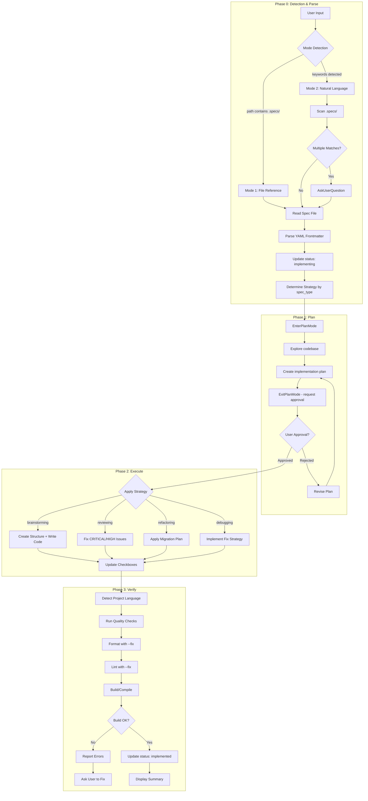

# Implementing Skill

## CRITICAL CONSTRAINTS

**YOU MUST FOLLOW THESE RULES WITHOUT EXCEPTION:**

1. **ALWAYS** read spec file BEFORE any implementation
2. **⚠️ MUST confirm spec file with user before updating status** (even if only 1 match)
3. **ALWAYS** update spec status to `implementing` ONLY after user confirms
4. **MUST** use EnterPlanMode at the **START of Phase 1** to plan implementation
5. **MUST** use ExitPlanMode to get user approval before proceeding to Phase 2
6. **AFTER plan approval**: Create TodoWrite with sub-tasks from approved plan
7. **ALWAYS** execute approved plan in Phase 2
8. **⚠️ MUST update spec file checkbox `[x]` IMMEDIATELY after completing each task**
9. **ALWAYS** update spec status to `implemented` on completion
10. **ALWAYS** mark todos as completed in TodoWrite after each task
11. **NEVER** skip quality checks unless explicitly told
12. **ALWAYS** run format/lint with --fix flags first
13. **MUST** detect project language before quality checks
14. **NEVER** implement code not specified in spec
15. **ALWAYS** display summary at completion

---

## PHASE TRACKING

**Phases are displayed in conversation text only** - NOT in TodoWrite.

TodoWrite is used ONLY for sub-tasks after plan approval.

### Phase Display Format

```
═══════════════════════════════════════
📍 PHASE 0: Detection & Parse
═══════════════════════════════════════
[actions...]

═══════════════════════════════════════
📍 PHASE 1: Plan (EnterPlanMode)
═══════════════════════════════════════
[planning...]

═══════════════════════════════════════
📍 PHASE 2: Execute
═══════════════════════════════════════
[executing sub-tasks with TodoWrite...]

═══════════════════════════════════════
📍 PHASE 3: Verify
═══════════════════════════════════════
[quality checks...]
```

**Why this approach:**
- EnterPlanMode manages planning phase
- Sub-tasks from approved plan are tracked via TodoWrite in Phase 2

---

## Workflow Overview

```
Phase 0: Detection & Parse → Detect mode, load spec, update status, determine strategy
Phase 1: Plan              → EnterPlanMode → Create plan → ExitPlanMode (user approval)
Phase 2: Execute           → Execute approved plan → Update checkboxes
Phase 3: Verify            → Run quality checks, update status, display summary
```



---

## Phase 0: Detection & Parse

### Entry Criteria

- User has invoked `/implementing` with arguments

### Actions

**STEP 0: Display Phase Header**

```
═══════════════════════════════════════
📍 PHASE 0: Detection & Parse
═══════════════════════════════════════
```

**STEP 1: Mode Detection**

```
IF $ARGUMENTS contains ".specs/" OR ends with ".md":
    mode = "file_reference"
    spec_path = $ARGUMENTS

ELIF $ARGUMENTS is not empty:
    mode = "natural_language"
    keywords = extract_keywords($ARGUMENTS)
    matches = glob(".specs/*{keywords}*.md")

    IF len(matches) == 0:
        ERROR: No matching spec files found
    ELIF len(matches) > 1:
        spec_path = AskUserQuestion(matches)
    ELSE:
        spec_path = matches[0]

ELSE:
    ERROR: No input provided. Usage:
    - /implementing .specs/brainstorming-*.md
    - /implementing implement auth feature
```

**⚠️ STEP 1.5: Confirm Spec File with User (MANDATORY)**

**ALWAYS ask user to confirm before proceeding, even if only 1 match found:**

```
AskUserQuestion:
  question: "Tìm thấy spec file: {spec_filename}. Bạn có muốn implement spec này không?"
  options:
    - "Yes, proceed" → Continue to STEP 2
    - "No, cancel" → Abort implementation
```

**Why this matters:**
- Prevents accidental implementation of wrong spec
- User has final control before status changes
- Allows user to review spec details before committing

**STEP 2: Read and Parse Spec File**

1. Use Read tool to load spec file
2. Parse YAML frontmatter to extract:
   - `spec_type`: brainstorming | debugging | refactoring | reviewing
   - `status`: should be `complete`
   - `related_files`: files to reference
3. Identify primary section based on spec_type (see `references/strategies.md`)

**STEP 3: Update Status (ONLY after user confirms)**

Use Edit tool to update spec file:
```yaml
status: complete → status: implementing
```

**Note:** This step runs ONLY after user confirms in STEP 1.5

**STEP 4: Determine Strategy**

Based on `spec_type`, identify which strategy to use in Phase 1:
- `brainstorming` → Create & Write strategy
- `reviewing` → Fix Issues strategy
- `refactoring` → Migrate & Preserve strategy
- `debugging` → Fix & Verify strategy

### Exit Criteria

- [ ] Mode detected (file_reference OR natural_language)
- [ ] Spec file loaded and parsed
- [ ] **User confirmed spec file** (via AskUserQuestion)
- [ ] Status updated to `implementing`
- [ ] Strategy determined based on spec_type

### Gate 0→1 Transition

- **GO**: User confirmed, spec parsed, strategy determined → **PROCEED TO PHASE 1**
- **HOLD**: Waiting for user confirmation
- **ABORT**: User cancelled OR No spec found OR invalid format

---

## Phase 1: Plan

### Entry Criteria

- Phase 0 complete
- Spec type and strategy identified
- Status is `implementing`

### Actions

**STEP 0: Display Phase Header**

```
═══════════════════════════════════════
📍 PHASE 1: Plan
═══════════════════════════════════════
```

**STEP 1: Enter Plan Mode**

```
EnterPlanMode()
```

This transitions into plan mode where you:
- Explore the codebase to understand existing patterns
- Read related files mentioned in spec
- Design implementation approach based on spec_type strategy

**STEP 2: Create Implementation Plan**

Plan must include:
1. **Overview**: What will be implemented
2. **Files to Create/Modify**: List with descriptions
3. **Implementation Steps**: Numbered task breakdown
4. **Dependencies**: Order of operations
5. **Verification**: How to test each step

**STEP 3: Exit Plan Mode for User Approval**

```
ExitPlanMode(allowedPrompts: [
  { tool: "Bash", prompt: "run tests" },
  { tool: "Bash", prompt: "run build" },
  { tool: "Bash", prompt: "run format/lint" }
])
```

User will review the plan and:
- **Approve**: Proceed to Phase 2
- **Request changes**: Revise plan and re-submit
- **Reject**: Abort implementation

### Exit Criteria

- [ ] EnterPlanMode invoked
- [ ] Implementation plan created
- [ ] ExitPlanMode called with appropriate permissions
- [ ] User has approved the plan

### Gate 1→2 Transition

**After user approves plan, create TodoWrite with sub-tasks ONLY:**

```
TodoWrite([
  { content: "Task-001: [description]", status: "pending", activeForm: "[doing description]" },
  { content: "Task-002: [description]", status: "pending", activeForm: "[doing description]" },
  ...
])
```

- **GO**: User approved plan → **PROCEED TO PHASE 2**
- **HOLD**: User requests plan revision
- **ABORT**: User rejects implementation

---

## Phase 2: Execute

### Entry Criteria

- Phase 1 complete (plan approved by user)
- Implementation plan approved

### Actions

**STEP 0: Display Phase Header & Create Sub-Task Todos**

```
═══════════════════════════════════════
📍 PHASE 2: Execute
═══════════════════════════════════════
```

Create TodoWrite with sub-tasks from approved plan:
```
TodoWrite([
  { content: "Task-001: [description]", status: "pending", activeForm: "[doing]" },
  { content: "Task-002: [description]", status: "pending", activeForm: "[doing]" },
  ...
])
```

**STEP 1: Execute Approved Plan**

Execute each sub-task sequentially:

```
FOR each sub-task in approved plan:
    1. Mark sub-task as in_progress in TodoWrite
    2. Execute the task based on spec_type strategy
    3. Mark sub-task as completed in TodoWrite
    4. ⚠️ IMMEDIATELY update checkbox in spec file (see STEP 2)

WHEN all sub-tasks completed:
    → Phase 2 is done
    → Proceed to Gate 2→3
```

**⚠️ STEP 2: Update Spec File Checkboxes (MANDATORY AFTER EACH TASK)**

After completing EACH task, you MUST update the corresponding checkbox in the spec file:

```
Use Edit tool:
  file_path: {spec_file_path}
  old_string: "- [ ] Task description"
  new_string: "- [x] Task description"
```

**Example:**
```
# Before task completion
- [ ] Implement user registration endpoint
- [ ] Add input validation

# After completing "Implement user registration endpoint"
- [x] Implement user registration endpoint  ← Updated immediately
- [ ] Add input validation
```

**Why this matters:**
- Spec file is the source of truth for implementation progress
- Checkboxes provide audit trail of what was completed
- Allows resuming implementation if interrupted
- User can verify progress by reading spec file

**STEP 2: Apply Strategy Based on spec_type**

Refer to `references/strategies.md` for detailed execution logic.

#### Strategy: brainstorming

| Focus | Implementation Tasks, Architecture Diagram, Data Models, API Contracts |
|-------|-----------------------------------------------------------------------|
| Actions | Create directories, write files, implement features |
| Output | New code files matching architecture |

#### Strategy: reviewing

| Focus | MUST FIX NOW, FIX BEFORE MERGE sections |
|-------|----------------------------------------|
| Actions | Fix CRITICAL issues first, then HIGH issues |
| Skip | MEDIUM and LOW severity issues |
| Output | Fixed code with issues resolved |

#### Strategy: refactoring

| Focus | Migration Plan, Characterization Tests |
|-------|---------------------------------------|
| Actions | Follow step-by-step migration, preserve behavior |
| Verify | Run characterization tests after each step |
| Output | Refactored code with same behavior |

#### Strategy: debugging

| Focus | Fix Strategy (FIX-001), Verification Criteria |
|-------|---------------------------------------------|
| Actions | Implement recommended fix from spec |
| Verify | Run verification steps to confirm fix |
| Output | Bug fixed, verification passing |

### Exit Criteria

- [ ] All tasks from approved plan executed
- [ ] **All spec file checkboxes marked `[x]`** (verify by re-reading spec file)
- [ ] All TodoWrite sub-tasks marked `completed`
- [ ] Code implementation matches spec

### Gate 2→3 Transition

**Before proceeding, verify:**
1. All sub-tasks in TodoWrite are `completed`
2. All checkboxes in spec file are `[x]` (use Read tool to verify)

- **GO**: All tasks completed → **PROCEED TO PHASE 3**
- **HOLD**: Blocked by unclear requirement (use AskUserQuestion)
- **ABORT**: Fundamental issue with implementation

---

## Phase 3: Verify

### Entry Criteria

- Phase 2 complete
- All implementation tasks done

### Actions

**STEP 0: Display Phase Header**

```
═══════════════════════════════════════
📍 PHASE 3: Verify
═══════════════════════════════════════
```

**STEP 1: Detect Project Language**

```
DETECT language by file presence:
    package.json OR package-lock.json OR yarn.lock → javascript/typescript
    pyproject.toml OR requirements.txt OR setup.py → python
    go.mod OR go.sum → go
    Cargo.toml OR Cargo.lock → rust
    pom.xml OR build.gradle → java
    composer.json → php
    (none found) → skip quality checks with warning
```

**STEP 2: Run Quality Checks**

Refer to `references/quality-checks.md` for language-specific commands.

```
FOR each quality step (format, lint, build):
    RUN command with --fix flag (if available)

    IF error AND not auto-fixable:
        REPORT error to user
        CHECKPOINT: Ask how to proceed
            - Option 1: Fix manually and continue
            - Option 2: Skip this check
            - Option 3: Abort implementation
    ELSE:
        CONTINUE to next step
```

**STEP 3: Update Spec Status**

Use Edit tool to update spec file:
```yaml
status: implementing → status: implemented
```

**STEP 4: Display Summary**

Output completion summary (see Output Summary Format below).

### Exit Criteria

- [ ] Quality checks passed (or skipped with user approval)
- [ ] Spec status updated to `implemented`
- [ ] Summary displayed

### Gate 3→Complete Transition

- **GO**: All checks passed → **IMPLEMENTATION COMPLETE**
- **HOLD**: Quality issues need manual fix
- **ABORT**: Critical build failure

---

## Output Summary Format

```
========================================
IMPLEMENTATION COMPLETE
========================================

Spec File: {spec_path}
Spec Type: {spec_type}
Input Mode: {file_reference | natural_language}

---

Execution Summary:
- Tasks Completed: {count}
- Files Created: {list}
- Files Modified: {list}

---

Quality Check Results:
- Format: {PASS | FAIL | SKIPPED}
- Lint: {PASS | FAIL | WARNINGS | SKIPPED}
- Build: {PASS | FAIL | SKIPPED}

---

Status Transition: complete → implementing → implemented ✓

========================================
```

---

## Mode Behavior Reference

### Mode 1: File Reference

**Trigger**: Argument contains `.specs/` or ends with `.md`

**Examples**:
```
/implementing .specs/brainstorming-auth-feature-1801261458.md
/implementing brainstorming-auth-*.md
```

**Behavior**:
1. Direct file path lookup
2. Glob expansion if wildcards present
3. Single match: proceed immediately
4. Multiple matches: use AskUserQuestion

### Mode 2: Natural Language

**Trigger**: Argument contains keywords without file path syntax

**Examples**:
```
/implementing implement the auth feature
/implementing fix the login bug
/implementing apply payment refactoring
```

**Behavior**:
1. Extract keywords from input
2. Scan `.specs/` for matching files
3. Match against: slug, tags, filename
4. Present matches for user confirmation

---

## Error Handling

### No Spec Found
```
Error: No matching spec files found for: {keywords}

Available specs in .specs/:
{list of available spec files}

Please specify a valid spec file or keyword.
```

### Invalid Spec Format
```
Warning: Could not parse spec file as expected format.

Missing required fields: {list}
Found sections: {list}

Proceeding with available information...
```

### Quality Check Failure
```
Quality Check Failed: {step}

Error Output:
{error_message}

Options:
1. Fix the issue manually and retry
2. Skip this quality check
3. Abort implementation

How would you like to proceed?
```

---

## Reference Files

- **references/strategies.md**: Detailed execution strategies per spec_type
- **references/quality-checks.md**: Multi-language quality check commands

## Directory Structure

- **`.specs/`**: Spec files from producer skills (brainstorming, debugging, etc.)

---

## Examples

### Example 1: File Reference Mode

```
User: /implementing .specs/brainstorming-auth-feature-1801261458.md

═══════════════════════════════════════
📍 PHASE 0: Detection & Parse
═══════════════════════════════════════
- Mode: file_reference
- Spec found: brainstorming-auth-feature-1801261458.md

[AskUserQuestion]: "Tìm thấy spec file: brainstorming-auth-feature-1801261458.md. Bạn có muốn implement spec này không?"
- User: "Yes, proceed"

- Status updated: implementing
- Strategy determined: brainstorming (Create & Write)

═══════════════════════════════════════
📍 PHASE 1: Plan
═══════════════════════════════════════
- EnterPlanMode()
- Exploring codebase...
- Reading related files from spec...
- Creating implementation plan:
  1. Create auth module structure
  2. Implement user registration
  3. Implement login endpoint
- ExitPlanMode(allowedPrompts: [...])
- Waiting for user approval...
- User: "Approved"

═══════════════════════════════════════
📍 PHASE 2: Execute
═══════════════════════════════════════

TodoWrite([
  { content: "Task-001: Create auth module structure", status: "in_progress", ... },
  { content: "Task-002: Implement user registration", status: "pending", ... },
  { content: "Task-003: Implement login endpoint", status: "pending", ... }
])

- Executing Task-001...
  [code implementation...]
  → Edit spec file: "- [ ] Create auth module structure" → "- [x] Create auth module structure"
  → TodoWrite: Task-001 completed

- Executing Task-002...
  [code implementation...]
  → Edit spec file: "- [ ] Implement user registration" → "- [x] Implement user registration"
  → TodoWrite: Task-002 completed

- Executing Task-003...
  [code implementation...]
  → Edit spec file: "- [ ] Implement login endpoint" → "- [x] Implement login endpoint"
  → TodoWrite: Task-003 completed

- All sub-tasks completed

═══════════════════════════════════════
📍 PHASE 3: Verify
═══════════════════════════════════════
- Language detected: typescript
- Running quality checks...
  - Format: PASS
  - Lint: PASS (2 warnings auto-fixed)
  - Build: PASS
- Status updated: implemented

========================================
IMPLEMENTATION COMPLETE
========================================
```

### Example 2: Natural Language Mode

```
User: /implementing fix the payment validation bug

═══════════════════════════════════════
📍 PHASE 0: Detection & Parse
═══════════════════════════════════════
- Mode: natural_language
- Keywords: payment, validation, bug
- Found matches:
  1. debugging-payment-validation-1801251200.md
  2. debugging-payment-error-1801241530.md

[AskUserQuestion]: "Tìm thấy 2 spec files. Bạn muốn implement spec nào?"
- User selected: debugging-payment-validation-1801251200.md

[AskUserQuestion]: "Xác nhận implement spec: debugging-payment-validation-1801251200.md?"
- User: "Yes, proceed"

- Status updated: implementing
- Strategy determined: debugging (Fix & Verify)

═══════════════════════════════════════
📍 PHASE 1: Plan
═══════════════════════════════════════
- EnterPlanMode()
- Reading Root Cause Analysis from spec...
- Designing fix approach...
- Creating implementation plan:
  1. Implement FIX-001: Add null check
  2. Run verification steps
- ExitPlanMode(allowedPrompts: [...])
- Waiting for user approval...
- User: "Approved"

═══════════════════════════════════════
📍 PHASE 2: Execute
═══════════════════════════════════════

TodoWrite([
  { content: "FIX-001: Add null check for payment amount", status: "in_progress", ... },
  { content: "VERIFY: Run verification steps", status: "pending", ... }
])

- Executing FIX-001...
  [code implementation...]
  → Edit spec file: "- [ ] Implement FIX-001" → "- [x] Implement FIX-001"
  → TodoWrite: FIX-001 completed

- Executing VERIFY...
  [running verification...]
  → Edit spec file: "- [ ] Run verification steps" → "- [x] Run verification steps"
  → TodoWrite: VERIFY completed

- All sub-tasks completed

═══════════════════════════════════════
📍 PHASE 3: Verify
═══════════════════════════════════════
- Running quality checks...
- Status updated: implemented

========================================
IMPLEMENTATION COMPLETE
========================================
```
