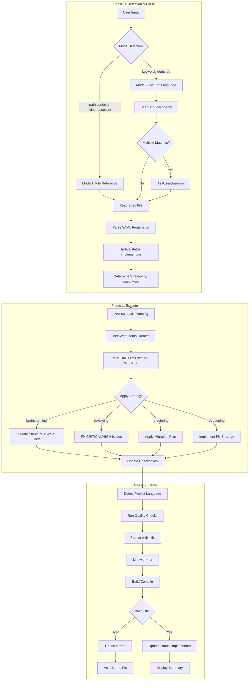

# Implementing Skill

## CRITICAL CONSTRAINTS

**YOU MUST FOLLOW THESE RULES WITHOUT EXCEPTION:**

1. **ALWAYS** read spec file BEFORE any implementation
2. **MUST** create Phase-level TodoWrite items FIRST (Phase 0, 1, 2) before any work
3. **ALWAYS** update spec status to `implementing` at start of Phase 0
4. **MUST** invoke Planning skill at the **START of Phase 1** (NOT in Phase 0)
5. **NEVER** stop after planning skill returns - Planning todos are **SUB-TODOS of Phase 1**
6. **ALWAYS** execute all sub-todos from Planning, then mark Phase 1 as completed
7. **ALWAYS** update spec status to `implemented` on completion
8. **ALWAYS** mark checkboxes `[x]` as tasks complete (both spec and TodoWrite)
9. **NEVER** skip quality checks unless explicitly told
10. **ALWAYS** run format/lint with --fix flags first
11. **MUST** use AskUserQuestion when multiple specs match
12. **MUST** detect project language before quality checks
13. **NEVER** implement code not specified in spec
14. **ALWAYS** display summary at completion

---

## PHASE-LEVEL TODO TRACKING

**CRITICAL**: Implementing skill MUST create its OWN phase-level todos at the START:

```
TodoWrite([
  { content: "Phase 0: Detection & Parse", status: "in_progress", activeForm: "Detecting and parsing spec" },
  { content: "Phase 1: Execute implementation", status: "pending", activeForm: "Executing implementation" },
  { content: "Phase 2: Verify and complete", status: "pending", activeForm: "Verifying implementation" }
])
```

**Why this matters:**
- Planning skill creates sub-todos for Phase 1 tasks
- When Planning returns, Implementing skill sees Phase 1 is still `in_progress`
- Implementing skill continues executing sub-todos until Phase 1 is done
- This prevents the agent from stopping after Planning returns

---

## Workflow Overview

```
Phase 0: Detection & Parse → Detect mode, load spec, update status, determine strategy
Phase 1: Execute           → Invoke Planning → IMMEDIATELY execute todos → Update checkboxes
Phase 2: Verify            → Run quality checks, update status, display summary
```



---

## Phase 0: Detection & Parse

### Entry Criteria

- User has invoked `/implementing` with arguments

### Actions

**STEP 0: Create Phase-Level Todos (MANDATORY FIRST STEP)**

```
TodoWrite([
  { content: "Phase 0: Detection & Parse", status: "in_progress", activeForm: "Detecting and parsing spec" },
  { content: "Phase 1: Execute implementation", status: "pending", activeForm: "Executing implementation" },
  { content: "Phase 2: Verify and complete", status: "pending", activeForm: "Verifying implementation" }
])
```

**STEP 1: Mode Detection**

```
IF $ARGUMENTS contains ".claude/.specs/" OR ends with ".md":
    mode = "file_reference"
    spec_path = $ARGUMENTS

ELIF $ARGUMENTS is not empty:
    mode = "natural_language"
    keywords = extract_keywords($ARGUMENTS)
    matches = glob(".claude/.specs/*{keywords}*.md")

    IF len(matches) == 0:
        ERROR: No matching spec files found
    ELIF len(matches) > 1:
        spec_path = AskUserQuestion(matches)
    ELSE:
        spec_path = matches[0]

ELSE:
    ERROR: No input provided. Usage:
    - /implementing .claude/.specs/brainstorming-*.md
    - /implementing implement auth feature
```

**STEP 2: Read and Parse Spec File**

1. Use Read tool to load spec file
2. Parse YAML frontmatter to extract:
   - `spec_type`: brainstorming | debugging | refactoring | reviewing
   - `status`: should be `complete`
   - `related_files`: files to reference
3. Identify primary section based on spec_type (see `references/strategies.md`)

**STEP 3: Update Status**

Use Edit tool to update spec file:
```yaml
status: complete → status: implementing
```

**STEP 4: Determine Strategy**

Based on `spec_type`, identify which strategy to use in Phase 1:
- `brainstorming` → Create & Write strategy
- `reviewing` → Fix Issues strategy
- `refactoring` → Migrate & Preserve strategy
- `debugging` → Fix & Verify strategy

### Exit Criteria

- [ ] Mode detected (file_reference OR natural_language)
- [ ] Spec file loaded and parsed
- [ ] Status updated to `implementing`
- [ ] Strategy determined based on spec_type

### Gate 0→1 Transition

**MUST update phase-level todos:**
```
TodoWrite([
  { content: "Phase 0: Detection & Parse", status: "completed", activeForm: "Detecting and parsing spec" },
  { content: "Phase 1: Execute implementation", status: "in_progress", activeForm: "Executing implementation" },
  { content: "Phase 2: Verify and complete", status: "pending", activeForm: "Verifying implementation" }
])
```

- **GO**: Spec parsed, strategy determined → **PROCEED TO PHASE 1**
- **HOLD**: Multiple matches, need user selection
- **ABORT**: No spec found or invalid format

---

## Phase 1: Execute

### Entry Criteria

- Phase 0 complete (marked as `completed` in TodoWrite)
- Phase 1 is `in_progress` in TodoWrite
- Spec type and strategy identified
- Status is `implementing`

### Actions

**STEP 1: Invoke Planning Skill**

```
Skill(skill: "planning", args: "{spec_path}")
```

Planning skill will:
- Parse spec content
- Create TodoWrite items from Implementation Tasks / Fix Strategy / Migration Plan
- These are **SUB-TODOS within Phase 1** (not replacement of phase todos)
- Return structured task breakdown

**⚠️ CRITICAL: PLANNING TODOS ARE SUB-TODOS**

```
After Planning skill returns:
→ Planning todos are SUB-TASKS of Phase 1
→ Phase 1 is still "in_progress" in YOUR phase-level tracking
→ You MUST execute ALL sub-todos
→ Only mark Phase 1 "completed" after ALL sub-todos are done
```

**STEP 2: Execute Sub-Todos from Planning**

Execute each sub-todo sequentially:

```
FOR each sub-todo from Planning:
    1. Mark sub-todo as in_progress
    2. Execute the task based on spec_type strategy
    3. Mark sub-todo as completed
    4. Update corresponding checkbox in spec file: [ ] → [x]

WHEN all sub-todos completed:
    → Phase 1 is done
    → Proceed to Gate 1→2
```

**STEP 3: Apply Strategy Based on spec_type**

Refer to `references/strategies.md` for detailed execution logic.

#### Strategy: brainstorming

| Focus | Implementation Tasks, Architecture Diagram, Data Models, API Contracts |
|-------|-----------------------------------------------------------------------|
| Actions | Create directories, write files, implement features |
| Output | New code files matching architecture |

#### Strategy: reviewing

| Focus | MUST FIX NOW, FIX BEFORE MERGE sections |
|-------|----------------------------------------|
| Actions | Fix CRITICAL issues first, then HIGH issues |
| Skip | MEDIUM and LOW severity issues |
| Output | Fixed code with issues resolved |

#### Strategy: refactoring

| Focus | Migration Plan, Characterization Tests |
|-------|---------------------------------------|
| Actions | Follow step-by-step migration, preserve behavior |
| Verify | Run characterization tests after each step |
| Output | Refactored code with same behavior |

#### Strategy: debugging

| Focus | Fix Strategy (FIX-001), Verification Criteria |
|-------|---------------------------------------------|
| Actions | Implement recommended fix from spec |
| Verify | Run verification steps to confirm fix |
| Output | Bug fixed, verification passing |

### Exit Criteria

- [ ] Planning skill invoked, sub-todos created
- [ ] All sub-todos executed and completed
- [ ] All spec checkboxes marked [x]
- [ ] Code implementation matches spec

### Gate 1→2 Transition

**MUST update phase-level todos:**
```
TodoWrite([
  { content: "Phase 0: Detection & Parse", status: "completed", activeForm: "Detecting and parsing spec" },
  { content: "Phase 1: Execute implementation", status: "completed", activeForm: "Executing implementation" },
  { content: "Phase 2: Verify and complete", status: "in_progress", activeForm: "Verifying implementation" }
])
```

- **GO**: All sub-todos completed → **PROCEED TO PHASE 2**
- **HOLD**: Blocked by unclear requirement (use AskUserQuestion)
- **ABORT**: Fundamental issue with spec

---

## Phase 2: Verify

### Entry Criteria

- Phase 1 complete
- All implementation tasks done

### Actions

**STEP 1: Detect Project Language**

```
DETECT language by file presence:
    package.json OR package-lock.json OR yarn.lock → javascript/typescript
    pyproject.toml OR requirements.txt OR setup.py → python
    go.mod OR go.sum → go
    Cargo.toml OR Cargo.lock → rust
    pom.xml OR build.gradle → java
    composer.json → php
    (none found) → skip quality checks with warning
```

**STEP 2: Run Quality Checks**

Refer to `references/quality-checks.md` for language-specific commands.

```
FOR each quality step (format, lint, build):
    RUN command with --fix flag (if available)

    IF error AND not auto-fixable:
        REPORT error to user
        CHECKPOINT: Ask how to proceed
            - Option 1: Fix manually and continue
            - Option 2: Skip this check
            - Option 3: Abort implementation
    ELSE:
        CONTINUE to next step
```

**STEP 3: Update Spec Status**

Use Edit tool to update spec file:
```yaml
status: implementing → status: implemented
```

**STEP 4: Display Summary**

Output completion summary (see Output Summary Format below).

### Exit Criteria

- [ ] Quality checks passed (or skipped with user approval)
- [ ] Spec status updated to `implemented`
- [ ] Summary displayed

### Gate 2→Complete Transition

**MUST update phase-level todos:**
```
TodoWrite([
  { content: "Phase 0: Detection & Parse", status: "completed", activeForm: "Detecting and parsing spec" },
  { content: "Phase 1: Execute implementation", status: "completed", activeForm: "Executing implementation" },
  { content: "Phase 2: Verify and complete", status: "completed", activeForm: "Verifying implementation" }
])
```

- **GO**: All checks passed, all phases completed → **IMPLEMENTATION COMPLETE**
- **HOLD**: Quality issues need manual fix
- **ABORT**: Critical build failure

---

## Output Summary Format

```
========================================
IMPLEMENTATION COMPLETE
========================================

Spec File: {spec_path}
Spec Type: {spec_type}
Input Mode: {file_reference | natural_language}

---

Execution Summary:
- Tasks Completed: {count}
- Files Created: {list}
- Files Modified: {list}

---

Quality Check Results:
- Format: {PASS | FAIL | SKIPPED}
- Lint: {PASS | FAIL | WARNINGS | SKIPPED}
- Build: {PASS | FAIL | SKIPPED}

---

Status Transition: complete → implementing → implemented ✓

========================================
```

---

## Mode Behavior Reference

### Mode 1: File Reference

**Trigger**: Argument contains `.claude/.specs/` or ends with `.md`

**Examples**:
```
/implementing .claude/.specs/brainstorming-auth-feature-1801261458.md
/implementing brainstorming-auth-*.md
```

**Behavior**:
1. Direct file path lookup
2. Glob expansion if wildcards present
3. Single match: proceed immediately
4. Multiple matches: use AskUserQuestion

### Mode 2: Natural Language

**Trigger**: Argument contains keywords without file path syntax

**Examples**:
```
/implementing implement the auth feature
/implementing fix the login bug
/implementing apply payment refactoring
```

**Behavior**:
1. Extract keywords from input
2. Scan `.claude/.specs/` for matching files
3. Match against: slug, tags, filename
4. Present matches for user confirmation

---

## Error Handling

### No Spec Found
```
Error: No matching spec files found for: {keywords}

Available specs in .claude/.specs/:
{list of available spec files}

Please specify a valid spec file or keyword.
```

### Invalid Spec Format
```
Warning: Could not parse spec file as expected format.

Missing required fields: {list}
Found sections: {list}

Proceeding with available information...
```

### Quality Check Failure
```
Quality Check Failed: {step}

Error Output:
{error_message}

Options:
1. Fix the issue manually and retry
2. Skip this quality check
3. Abort implementation

How would you like to proceed?
```

---

## Reference Files

- **references/strategies.md**: Detailed execution strategies per spec_type
- **references/quality-checks.md**: Multi-language quality check commands

---

## Examples

### Example 1: File Reference Mode

```
User: /implementing .claude/.specs/brainstorming-auth-feature-1801261458.md

[CREATE PHASE TODOS]
TodoWrite:
  - Phase 0: Detection & Parse (in_progress)
  - Phase 1: Execute implementation (pending)
  - Phase 2: Verify and complete (pending)

Phase 0: Detection & Parse
- Mode: file_reference
- Spec loaded: brainstorming-auth-feature-1801261458.md
- Status updated: implementing
- Strategy determined: brainstorming (Create & Write)

[TRANSITION: Phase 0 → completed, Phase 1 → in_progress]

Phase 1: Execute
- Invoking Planning skill...
- Planning creates SUB-TODOS:
  - [Phase 1] Create auth module structure
  - [Phase 1] Implement user registration
  - [Phase 1] Implement login endpoint
  ...
- Executing sub-todos (Phase 1 still in_progress)...
  [x] Create auth module structure
  [x] Implement user registration
  [x] Implement login endpoint
  ...
- All sub-todos completed

[TRANSITION: Phase 1 → completed, Phase 2 → in_progress]

Phase 2: Verify
- Language detected: typescript
- Running quality checks...
  - Format: PASS
  - Lint: PASS (2 warnings auto-fixed)
  - Build: PASS
- Status updated: implemented

[TRANSITION: Phase 2 → completed]

========================================
IMPLEMENTATION COMPLETE
========================================
...
```

### Example 2: Natural Language Mode

```
User: /implementing fix the payment validation bug

[CREATE PHASE TODOS]
TodoWrite:
  - Phase 0: Detection & Parse (in_progress)
  - Phase 1: Execute implementation (pending)
  - Phase 2: Verify and complete (pending)

Phase 0: Detection & Parse
- Mode: natural_language
- Keywords: payment, validation, bug
- Found matches:
  1. debugging-payment-validation-1801251200.md
  2. debugging-payment-error-1801241530.md
- [AskUserQuestion]: Which spec to implement?
- User selected: debugging-payment-validation-1801251200.md
- Status updated: implementing
- Strategy determined: debugging (Fix & Verify)

[TRANSITION: Phase 0 → completed, Phase 1 → in_progress]

Phase 1: Execute
- Invoking Planning skill...
- Planning creates SUB-TODOS:
  - [Phase 1] Implement FIX-001
  - [Phase 1] Run verification steps
- Executing sub-todos (Phase 1 still in_progress)...
  [x] Implement FIX-001: Add null check for payment amount
  [x] Payment with valid amount: PASS
  [x] Payment with null amount: PASS (no longer crashes)
- All sub-todos completed

[TRANSITION: Phase 1 → completed, Phase 2 → in_progress]

Phase 2: Verify
- Running quality checks...
- Status updated: implemented

[TRANSITION: Phase 2 → completed]

========================================
IMPLEMENTATION COMPLETE
========================================
```
