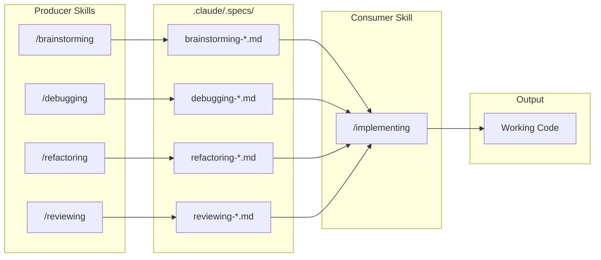
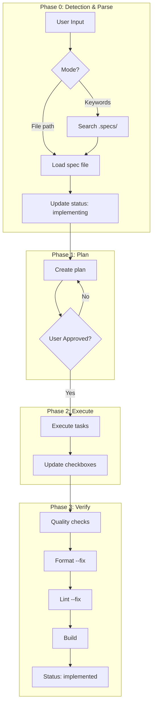
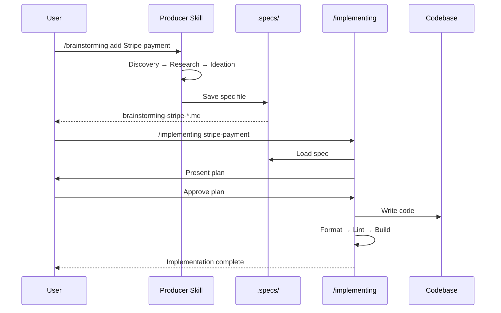

# LTVai-Kit

A structured Claude Code skill system for software development workflows.

## Overview

LTVai-Kit provides a **Producer → Consumer** workflow pattern for Claude Code:



## Quick Start

### Producer Skills - Generate Specifications

| Skill            | Purpose                      | Command          |
| ---------------- | ---------------------------- | ---------------- |
| `/brainstorming` | Feature design, architecture | `/brainstorming` |
| `/debugging`     | Bug analysis, root cause     | `/debugging`     |
| `/refactoring`   | Code quality improvement     | `/refactoring`   |
| `/reviewing`     | Code review, security audit  | `/reviewing`     |

### Consumer Skill - Execute Specifications

| Skill           | Purpose                        | Command                                     |
| --------------- | ------------------------------ | ------------------------------------------- |
| `/implementing` | Implement specs from producers | `/implementing .claude/.specs/spec-file.md` |

## Workflow

### 1. Generate Spec (Producer)

```bash
# Example: Design a new feature
/brainstorming add user authentication with OAuth
```

Output: `.claude/.specs/brainstorming-oauth-auth-1801261458.md`

### 2. Implement Spec (Consumer)

```bash
# By file path
/implementing .claude/.specs/brainstorming-oauth-auth-1801261458.md

# By natural language
/implementing implement the oauth authentication
```

## Producer Skills Detail

### `/brainstorming`

**Phases**: Discovery → Research → Ideation → Synthesis → Specification

**Output**:

- Architecture diagrams (Mermaid)
- Data models
- API contracts
- Implementation task list

### `/debugging`

**Phases**: Reproduce → Analyze → Root Cause → Fix Strategy

**Output**:

- Root Cause Analysis (RCA)
- Reproduction steps
- Fix recommendations

### `/refactoring`

**Phases**: Detect Smells → Design Patterns → Migration Plan

**Output**:

- Code smell report
- Target patterns
- Step-by-step migration plan

### `/reviewing`

**Phases**: Scan → Analyze → Score → Report

**Output**:

- Multi-dimension scoring
- Severity-categorized findings
- Actionable recommendations

## Consumer Skill Detail

### `/implementing`

**Phases**:



1. **Phase 0**: Detection & Parse - Load spec file
2. **Phase 1**: Plan - Create implementation plan (requires user approval)
3. **Phase 2**: Execute - Implement code from approved plan
4. **Phase 3**: Verify - Run quality checks (format, lint, build)

**Input modes**:

- File reference: `/implementing .claude/.specs/spec-file.md`
- Natural language: `/implementing implement auth feature`

## Utility Skills

| Skill                   | Purpose                     |
| ----------------------- | --------------------------- |
| `/ui-ux-pro-max`        | UI/UX design and components |
| `/mermaidjs-v11`        | Create Mermaid diagrams     |
| `/react-best-practices` | React/Next.js optimization  |

## Commands (No code generation)

| Command            | Purpose                       |
| ------------------ | ----------------------------- |
| `/discuss`         | Discuss ideas before coding   |
| `/optimize-prompt` | Improve prompts for better AI |

## Directory Structure

```
.claude/
├── .specs/          # Spec files from producer skills
├── skills/          # Skill definitions
│   ├── brainstorming/
│   ├── debugging/
│   ├── refactoring/
│   ├── reviewing/
│   ├── implementing/
│   └── ...
├── commands/        # Command definitions
└── rules/           # Global rules
```

## Example Workflow



```bash
# 1. User wants to add a feature
/brainstorming add payment processing with Stripe

# 2. Review generated spec
# → .claude/.specs/brainstorming-stripe-payment-1801261500.md

# 3. Implement the spec
/implementing .claude/.specs/brainstorming-stripe-payment-1801261500.md

# 4. Claude creates plan → User approves → Code implemented
```
