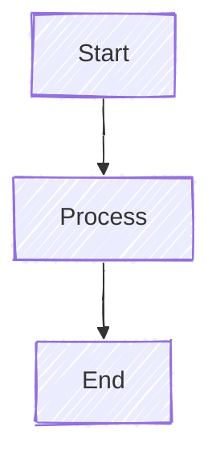

import { Aside, Tabs, TabItem } from "@astrojs/starlight/components";

## Overview

`/mermaidjs-v11` là Utility Skill cho việc tạo diagrams với Mermaid.js v11 syntax.

<Aside type="tip">
  Sử dụng `/mermaidjs-v11` khi cần tạo flowcharts, sequence diagrams, class diagrams, và nhiều loại diagram khác.
</Aside>

## Supported Diagram Types

| Type | Use Case |
|------|----------|
| `flowchart` | Process flows, decision trees |
| `sequenceDiagram` | Actor interactions, API flows |
| `classDiagram` | OOP structures, data models |
| `stateDiagram` | State machines, workflows |
| `erDiagram` | Database relationships |
| `gantt` | Project timelines |
| `journey` | User experience flows |
| `pie` | Data distribution |
| `mindmap` | Concept mapping |
| `timeline` | Historical events |

## Quick Start

```
/mermaidjs-v11 Create a flowchart for user authentication
```

Claude sẽ generate:


## Diagram Examples

<Tabs>
  <TabItem label="Flowchart">
    ```mermaid
    flowchart TD
        Start([Start]) --> Input[/User Input/]
        Input --> Process[Process Data]
        Process --> Decision{Valid?}
        Decision -->|Yes| Success[Success]
        Decision -->|No| Error[Error]
        Success --> End([End])
        Error --> Input
    ```

    **Node shapes:**
    - `[text]` - Rectangle
    - `([text])` - Stadium
    - `{text}` - Diamond (decision)
    - `[/text/]` - Parallelogram (input/output)
  </TabItem>

  <TabItem label="Sequence Diagram">
    ```mermaid
    sequenceDiagram
        participant U as User
        participant A as API
        participant D as Database

        U->>A: POST /login
        A->>D: Query user
        D-->>A: User data
        alt Valid password
            A-->>U: 200 OK + Token
        else Invalid
            A-->>U: 401 Unauthorized
        end
    ```

    **Arrow types:**
    - `->>` - Solid line with arrow
    - `-->>` - Dotted line with arrow
    - `-x` - Solid line with X
  </TabItem>

  <TabItem label="Class Diagram">
    ```mermaid
    classDiagram
        class User {
            +String id
            +String email
            +login()
            +logout()
        }
        class Order {
            +String id
            +Date createdAt
            +calculate()
        }
        User "1" --> "*" Order : places
    ```

    **Relationships:**
    - `-->` - Association
    - `--|>` - Inheritance
    - `..|>` - Implementation
    - `--*` - Composition
  </TabItem>

  <TabItem label="ER Diagram">
    ```mermaid
    erDiagram
        USER ||--o{ ORDER : places
        ORDER ||--|{ LINE_ITEM : contains
        PRODUCT ||--o{ LINE_ITEM : "ordered in"

        USER {
            int id PK
            string email
            string name
        }
        ORDER {
            int id PK
            int user_id FK
            date created_at
        }
    ```

    **Cardinality:**
    - `||` - Exactly one
    - `o{` - Zero or more
    - `|{` - One or more
  </TabItem>

  <TabItem label="State Diagram">
    ```mermaid
    stateDiagram-v2
        [*] --> Draft
        Draft --> Pending : Submit
        Pending --> Approved : Approve
        Pending --> Rejected : Reject
        Rejected --> Draft : Revise
        Approved --> [*]
    ```

    **Notation:**
    - `[*]` - Start/End state
    - `-->` - Transition
    - `: label` - Transition label
  </TabItem>

  <TabItem label="Gantt Chart">
    ```mermaid
    gantt
        title Project Timeline
        dateFormat YYYY-MM-DD
        section Planning
            Requirements    :a1, 2024-01-01, 7d
            Design          :a2, after a1, 5d
        section Development
            Backend         :b1, after a2, 14d
            Frontend        :b2, after a2, 14d
        section Testing
            QA              :c1, after b1, 7d
    ```
  </TabItem>
</Tabs>

## Configuration Options

### Themes


Available themes:
- `default` - Standard colors
- `dark` - Dark mode
- `forest` - Green tones
- `neutral` - Grayscale
- `base` - Minimal styling

### Look Styles



- `classic` - Clean lines
- `handDrawn` - Sketch-like appearance

## Integration Methods

### Markdown Code Block

```markdown

```

### HTML Embedding

```html
<pre class="mermaid">
flowchart LR
    A --> B
</pre>
<script src="https://cdn.jsdelivr.net/npm/mermaid/dist/mermaid.min.js"></script>
<script>mermaid.initialize({startOnLoad: true});</script>
```

### CLI Conversion

```bash
# Install CLI
npm install -g @mermaid-js/mermaid-cli

# Convert to PNG
mmdc -i diagram.mmd -o diagram.png

# Convert to SVG
mmdc -i diagram.mmd -o diagram.svg
```

## Best Practices

1. **Keep It Simple**: Avoid overcrowded diagrams
2. **Use Subgraphs**: Group related nodes
3. **Consistent Direction**: Stick to TD or LR
4. **Label Arrows**: Make relationships clear
5. **Use Colors Sparingly**: Highlight important elements only

## Subgraphs


## Styling


## Common Patterns

### API Flow


### Decision Tree


### Component Hierarchy


## Troubleshooting

### Diagram không render

- Check syntax errors
- Ensure mermaid.js loaded
- Try simpler version first

### Text bị cắt

- Shorten labels
- Use abbreviations
- Split into multiple diagrams

### Arrows overlap

- Change direction (TD ↔ LR)
- Add intermediate nodes
- Use subgraphs

## Related

- [Brainstorming](/skills/producer/brainstorming/) - Architecture diagrams
- [UI/UX Pro Max](/skills/utility/ui-ux-pro-max/) - Design visual flows
- [Workflow](/getting-started/workflow/) - Document workflows
